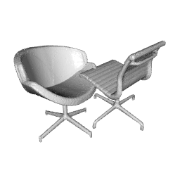
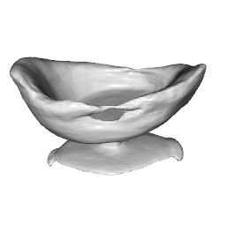
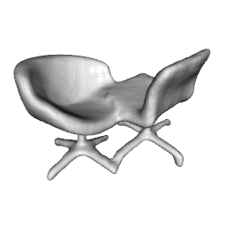

# Hierarchical Prior Networks

Official PyTorch implementation of the CVPR 2021 paper "Fostering Generalization in Single-view 3D Reconstruction 
by Learning a Hierarchy of Local and Global Shape Priors". Please cite our paper and the original Occupancy Networks (Mescheder et al.) if you use this work.


[[CVPR'21](https://openaccess.thecvf.com/content/CVPR2021/papers/Bechtold_Fostering_Generalization_in_Single-View_3D_Reconstruction_by_Learning_a_Hierarchy_CVPR_2021_paper.pdf)]
[[Video](https://www.youtube.com/watch?v=-LDHq4P0c8o)]
[[Arxiv](https://arxiv.org/abs/2104.00476)]

## Overview

|Input Depth |Ground Truth|
|:---: | :---: |
|||
|**OccNet** |**HPN (ours)**|
| |  |

## Installation
You can recreate our anaconda environment `mesho3d` using
```bash
conda env create -f mesho3d.yaml
conda activate mesho3d
```

Next, compile the extension modules as in the original Occupancy Networks.
You can do this via
```bash
python setup.py build_ext --inplace
```


## Demo Run
Download the pretrained models from [here](https://www.dropbox.com/s/nk7buzoinaghz8d/pretrained_checkpoints.zip?dl=0). Create a folder `mkdir out` 
and extract the checkpoints there `cd out && unzip pretrained_checkpoints.zip`. 

Generate meshes for the depth images in `data/demo/` using the statements below.
You will find them in `out/00_paper_genre/p32s16/generation_hierarchical3/`
and `out/00_paper_genre/p32s16/generation_hierarchical3_sdf/`
Note that these networks are trained on airplanes, cars and chairs.
```bash
python generate_merge3.py configs/00_paper_genre/genre_bl.yaml configs/00_paper_genre/genre_p32s16.yaml configs/00_paper_genre/genre_p64s32.yaml

python generate_merge3_sdfbl.py configs/00_paper_genre/onet_sdf/genre_bl_sdf.yaml configs/00_paper_genre/genre_p32s16.yaml configs/00_paper_genre/genre_p64s32.yaml
```
You can visualize the generated meshes `.off`, `.ply` and the `depth.npz` files using:
```bash
python vis.py filename
```
## Dataset
### Rendering Ground Truth Depth Images
This requires ShapeNetCore to be located in data/
```bash
conda env create -f pytorch3d.yaml
source activate pt3d
python render_depth.py
```
See more options running `python render_depth.py --help`

### Training Data Generation

Rough outline:
- render depth from shapenet shapes in different poses
- poses are sampled from azimuth and elevation
- apply the same poses to watertight meshes (see [David Stutz](https://github.com/davidstutz/mesh-fusion))
- sample points from the surface for evaluation
- sample points from the volume (unit cube) and extract occupied / free labels

## Training
```bash
python train.py configs/00_paper_genre/genre_bl.yaml
```
Train networks independently the same way as an original Occupancy Network.
Use the configs to specify the patch size and stride for the local networks.
You can find examples in `configs/00_paper_genre/` and `configs/00_paper_single/`

## Generation
```bash
python generate_merge3.py configs/00_paper_genre/genre_bl.yaml configs/00_paper_genre/genre_p32s16.yaml configs/00_paper_genre/genre_p64s32.yaml
```
```bash
python generate_merge5.py \
configs/00_paper_single/lamp_bl.yaml \
configs/00_paper_single/lamp_p32s16.yaml \
configs/00_paper_single/lamp_p64s32.yaml \
configs/00_paper_single/lamp_p128s64.yaml \
configs/00_paper_single/lamp_p16s8.yaml
```

Several versions exist for generate, depending on how many priors should be fused.

## Evaluation
This requires the pointcloud.npz file to reside next to the input depth.
This file contains 100000 points which have been sampled from the surface of the ground truth mesh in camera space.
```bash
python eval_meshes.py configs/config.yaml
python read_results.py configs/config.yaml
```

## Citation

If you find our paper or this code useful, please cite:

    @inproceedings{Bechtold2021HPN,
        title = {Fostering Generalization in Single-view 3D Reconstruction by Learning a Hierarchy of Local and Global Shape Priors},
        author = {Bechtold, Jan and Maxim, Tatarchenko and Volker, Fischer and Thomas, Brox},
        booktitle = {CVPR},
        year = {2021}
    }
    
We build upon the code of Occupancy Networks (Mescheder et al. CVPR 2019). If you use our work please also cite:

    @inproceedings{Occupancy Networks,
        title = {Occupancy Networks: Learning 3D Reconstruction in Function Space},
        author = {Mescheder, Lars and Oechsle, Michael and Niemeyer, Michael and Nowozin, Sebastian and Geiger, Andreas},
        booktitle = {Proceedings IEEE Conf. on Computer Vision and Pattern Recognition (CVPR)},
        year = {2019}
    }
Many thanks to them for this great work and great code.

## License
Hierarchical Prior Networks is open-sourced under the AGPL-3.0 license. See the
[LICENSE.md](LICENSE) file for details.
For a list of other open source components included in **HierarchicalPriorNetworks**, see the
file [3rd-party-licenses.txt](3rd-party-licenses.txt).
